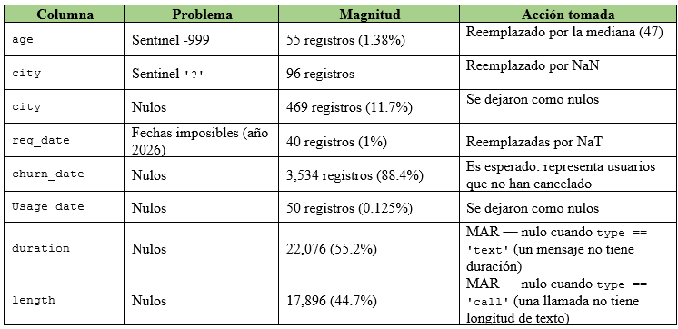

## 🎯 Objetivo del proyecto:

Identificar patrones de uso, detectar comportamientos atípicos y comprender qué segmentos de clientes muestran necesidades diferenciadas, con el fin de optimizar la oferta comercial y mejorar la experiencia del usuario.

## 🗂️ Fuentes de datos:

1. plans.csv: los planes actuales (precio, minutos incluidos, GB incluidos, costo por extra).

2. users_latam.csv: información de clientes: edad, ciudad, fecha de registro, plan contratado.

3. usage.csv: el detalle de uso real: llamadas (duración) y mensajes (longitud).

## 🔍 Las etapas del análisis realizadas:

1. Cargar y explorar los tres datasets.

2. Identificar los problemas de calidad de los datos.

3. Detectar valores invalidos o sentinels.

4. Revisar y estandarizar fechas.

5. Limpiar datos.

6. Resumen estadístico.

7. Visualizar distribuciones.

8. Segmentar clientes.

9. Insight ejecutivo.

 ## 🚀 Cómo ejecutar el notebook: 
 
#### ⚙️ Abrir en Google Colab:

1. Ve al archivo `.ipynb` dentro de este repositorio. 📓 [Ver notebook del análisis](S7%20Version-Estudiante-Project-ConnectaTel.ipynb)
  
2. Haz clic en el botón **"Open in Colab"** (o copia la URL del notebook y pégala en [https://colab.research.google.com](https://colab.research.google.com) → pestaña "GitHub").
   
3. Una vez abierto, ejecuta las celdas en orden desde el menú **Runtime > Run all**.

> No necesitas instalar Python ni librerías localmente; Colab ya las incluye.

## 📋 Guía de reproducción:

1. Asegúrate de tener los datasets (`plans.csv`, `users_latam.csv`, `usage.csv`) en la misma carpeta que el notebook, o en la ruta indicada dentro del código.
   
2. Ejecuta las celdas **en orden secuencial**, ya que algunas dependen de variables o transformaciones definidas en pasos anteriores (por ejemplo, la limpieza de `NaT` y sentinels debe correr antes del análisis de segmentos).
   
3. Los resultados principales (segmentación por edad, nivel de uso, y detección de outliers) se generan automáticamente al final del notebook.

## 📊 Resultados y conclusiones:

### Problemas de calidad de datos encontrados:

 

## Segmentacóon de usuarios:

## 🔍 Segmentos por Edad 
- 👴 Adulto mayor (≥60): 1222 usuarios  (30.6%)
- 🧑 Adulto (<60): 2018 usuarios  (50.5%)
- 🧒 Joven (<30): 760 usuarios (19.0%)

## 📊 Segmentos por Nivel de Uso 
- 🟢 Bajo uso: 778 usuarios (19.5%)
- 🟡 Uso medio: 2943 usuarios  (73.6%)
- 🔴 Alto uso: 279 usuarios (7.0%)

## 📞 Por plan
- 📞 Básico: 64.9% de los usuarios
- 📞 Premium: 35.1% de los usuarios

La distribución de edad es prácticamente la misma en ambos planes, lo que sugiere que la elección de plan no está determinada por la edad, sino probablemente por el nivel de uso o precio.

## Gráficos
 

**Insight:** La distribución tiene un sesgo marcado hacia la derecha. La mayoría de los usuarios consume entre 5 y 30 minutos, pero existe una cola que se extiende hasta más de 150 minutos, confirmando la presencia de un grupo pequeño de usuarios con consumo muy por encima del resto. Este patrón se repite en ambos planes (Básico y Premium).

---

 

**Insight:** El boxplot confirma visualmente lo observado en el histograma: existen 109 outliers (2.73% de los usuarios), con un límite superior de 61.86 minutos según el método IQR. Estos valores no se consideran errores de datos, sino usuarios de alto consumo real.

---

 

**Insight:** El 73.6% de los usuarios (2,943) se concentra en "Uso medio", mientras que "Bajo uso" representa el 19.5% (778) y "Alto uso" solo el 7.0% (279). Esto indica que la base de clientes es mayoritariamente moderada en su consumo, con un segmento pequeño pero valioso de alto uso.

---

**Insight:** Los adultos (30-59 años) son el grupo predominante con 50.5% (2,018), seguidos por adultos mayores (60+) con 30.6% (1,222) y jóvenes (<30) con 19.0% (760). Combinado con el hallazgo de que la edad no varía entre planes, esto sugiere que la segmentación por edad no está impulsando la elección de plan.

---

## ⚠️ Outliers detectados
- 📞 Llamadas: 30 usuarios superan el límite de 10.5 llamadas
- 💬 Mensajes: 46 usuarios superan el límite de 11.5 mensajes
- ⏱️ Minutos de llamada: 109 usuarios (2.73%) superan el límite de 61.86 minutos, llegando hasta 155.7 minutos frente a un promedio de 23.3

Se decidió mantener estos outliers, ya que representan comportamiento real de clientes de alto consumo (no errores de captura), y son justo el segmento más valioso para diseñar ofertas diferenciadas.

## 💡 Recomendaciones de negocio:

-Plan intermedio o "Alto uso": el 7% de usuarios en el segmento de alto uso, con picos de hasta 155 minutos, sugiere una oportunidad de crear un plan con más minutos/mensajes incluidos, evitando cargos por excedente y aumentando la retención de este grupo de alto valor.

-Segmento "Bajo uso" (19.5%): podría beneficiarse de un plan más económico o de prepago, reduciendo el riesgo de churn por sobreprecio.
Revisar calidad de captura de city y reg_date: un 11.7% de nulos en ciudad limita el análisis geográfico; vale la pena revisar el proceso de registro de clientes.

-churn_date con 88.4% de nulos es información valiosa poco explotada: se recomienda un análisis específico de churn cruzando plan, edad y nivel de uso para entender qué perfil cancela más.

## ⚠️ Limitaciones:

-El análisis se basa en datos hasta 2024; no captura tendencias más recientes.

-No se profundizó en el análisis de churn (aunque los datos lo permiten).

-El dataset plans solo tiene 2 planes, lo que limita comparar más variedad de ofertas.
